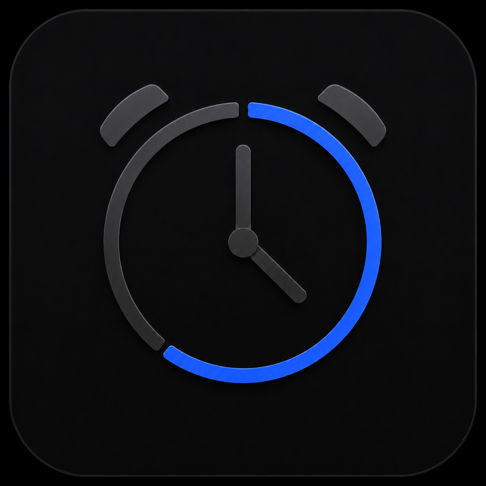
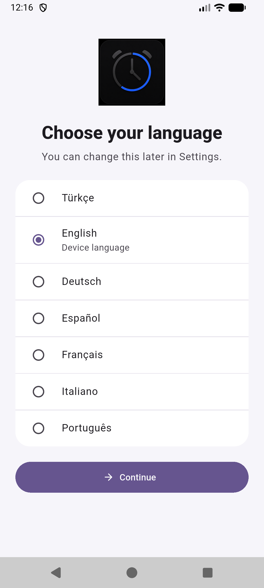
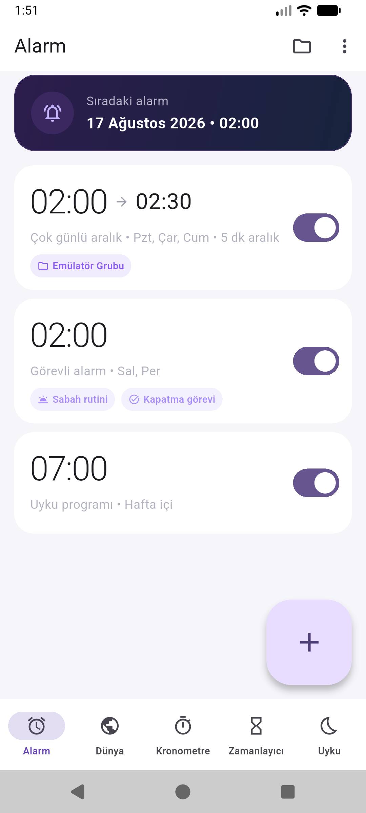
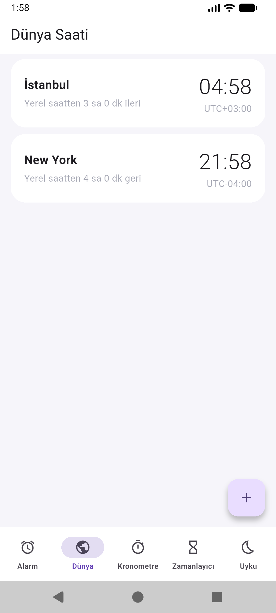
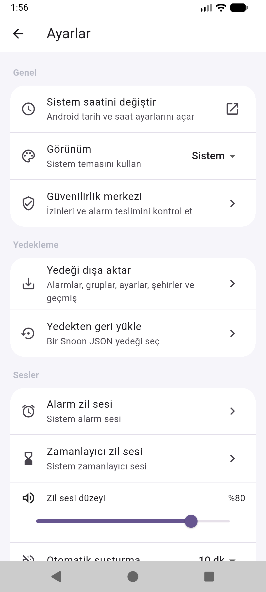
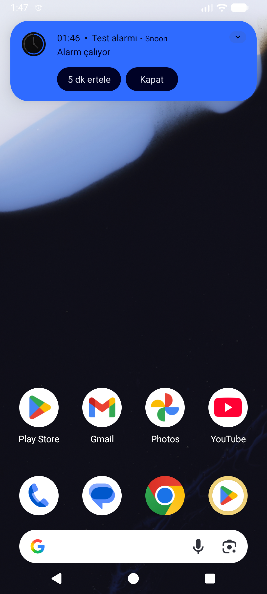
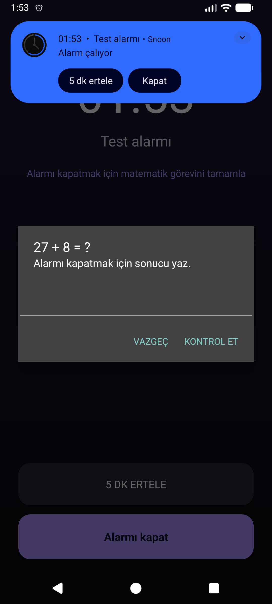
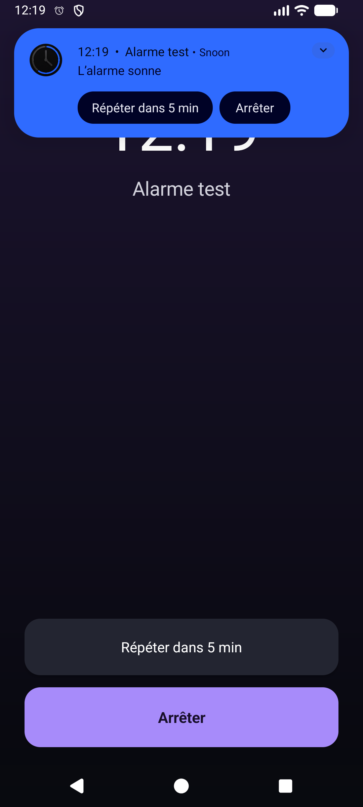

<p align="center">
  
</p>

<h1 align="center">Snoon</h1>

<p align="center"><strong>Gerçek hayat programları için güvenilir Android alarmı.</strong></p>

<p align="center">
  <a href="README.md">English</a> · <a href="README_TR.md">Türkçe</a>
</p>

Snoon; alışılmış alarm, dünya saati, kronometre, zamanlayıcı ve uyku araçlarını esnek program yönetimiyle birleştiren, Flutter ile geliştirilmiş gizlilik odaklı bir saat uygulamasıdır. Bir saat aralığındaki bütün alarmları tek işlemle oluşturabilir, tekrarlanan alarm gruplarını tatil boyunca duraklatabilir veya kalıcı programı bozmadan yalnızca bugünün saatlerini kaydırabilirsin.

> Durum: Aktif Android geliştirmesi. En düşük sürüm: Android 8.0 (API 26).

## Öne çıkanlar

- Tek seferlik, haftalık ve gece yarısını geçen alarmlar oluşturma
- Saat aralığında 1, 2, 5, 10 veya 15 dakikada bir otomatik alarm üretme
- Tatil duraklatması ve istisna tarihleri bulunan alarm grupları
- Seçili alarmları veya bütün grubu yalnızca bugün için kaydırma
- İsteğe bağlı matematik veya telefonu sallama kapatma görevleri
- Kilit ekranı bildiriminden doğrudan **Ertele** ve **Kapat** işlemleri
- Güvenilirlik Merkezi ile izin, alarm sesi ve pil kısıtlaması denetimi
- Cihazda yerel veri saklama ve JSON yedekleme/geri yükleme
- Türkçe, İngilizce, Almanca, İspanyolca, Fransızca, İtalyanca ve Portekizce

## Ekran görüntüleri

<p align="center">
  
  
  
</p>

<p align="center">
  
  
  
  
</p>

## Özellikler

### Alarm ve program yönetimi

- Zil sesi, etiket, titreşim, tekrar günleri ve çaldıktan sonra silme
- Ayarlanabilir erteleme süresi/sayısı ve ses tuşu davranışı
- Artan ses, otomatik susturma, ön bildirim ve yedek alarm
- Ertele/Kapat eylemli tam ekran kilit ekranı alarmı
- Alarm grupları, tatil duraklatması, istisna takvimi ve toplu işlemler
- Varsayılan olarak kapalı sabah rutini ve kapatma görevleri
- Alarm geçmişi ve uygulama içinden 10 saniyelik teslim testi
- Yeniden başlatma, saat ve saat dilimi değişiminden sonra otomatik planlama

### Saat araçları

- Şehir arama ve yaz/kış saati destekli dünya saati
- Tur özellikli kronometre
- Hazır ve özel süreli zamanlayıcı
- Rahatlama bildirimi ve uyanma alarmıyla uyku programı
- Sistem, açık ve koyu tema

## Diller

Snoon ilk açılışta Android izinlerinden önce dil seçtirir. Dil daha sonra uygulamayı yeniden başlatmadan **Ayarlar → Uygulama dili** bölümünden değiştirilebilir.

Flutter ekranları ve Android'in yerel alarm bildirimi aynı seçili dili kullanır. Desteklenmeyen cihaz dillerinde güvenli geri dönüş dili İngilizcedir.

## Gizlilik

Snoon'da hesap, reklam, analiz veya takip SDK'sı bulunmaz. Alarm, grup, ayar, uyku ve geçmiş verileri kullanıcı açıkça JSON yedeği dışa aktarmadıkça cihazdan çıkmaz. Ayrıntılar için [gizlilik politikasına](PRIVACY_POLICY.md) bakabilirsin.

## Geliştirme

Gereksinimler:

- Flutter 3.47 veya üzeri
- Dart 3.13 veya üzeri
- Android Studio ve Android SDK
- JDK 17
- Android 8.0+ cihaz veya emülatör

```powershell
flutter pub get
flutter gen-l10n
flutter analyze
flutter test
flutter build apk --debug
```

Release derlemesi için yerel `android/key.properties` ve upload keystore gerekir. Bu gizli dosyalar Git tarafından özellikle yok sayılır. Ayrıntılar [yayın kontrol listesinde](RELEASE_CHECKLIST.md) bulunur.

## Mimari

- **Flutter/Dart:** Arayüz, yerel veri modeli, çoklu dil ve kullanıcı akışları
- **Kotlin/Android:** Kesin zamanlama, alarm sesi, titreşim, tam ekran etkinlik, bildirim eylemleri ve yeniden başlatma kurtarması
- **SharedPreferences:** Hesapsız yerel veri saklama
- **ARB + Android kaynakları:** Birbiriyle uyumlu Flutter ve yerel Android çevirileri

## Android izinleri

| İzin | Kullanım amacı |
| --- | --- |
| Bildirim | Yaklaşan, ertelenen ve çalan alarm kontrolleri |
| Kesin alarm | Kullanıcının belirlediği anda alarm teslimi |
| Tam ekran | Kilit ekranında alarm yönetimi |
| Titreşim | Yalnızca kullanıcı açtığında titreşim |
| Yeniden başlatma | Telefon açıldığında alarmları geri yükleme |
| Ön plan medya oynatma | Çalarken alarm sesini güvenilir sürdürme |

## Testler

Depoda model, veri deposu, widget, yerelleştirme ve tam Android entegrasyon testleri bulunur. Entegrasyon testi; çok günlü aralık alarmı, gruplar, dünya saati, kronometre, zamanlayıcı, uyku planı, ayarlar ve güvenilirlik kontrollerini kapsar.

```powershell
flutter analyze
flutter test
flutter test integration_test/full_app_test.dart -d <android-cihaz-kimliği>
```

## Proje belgeleri

- [Ürün gereksinimleri](PRODUCT_REQUIREMENTS.md)
- [Yol haritası](Yapılacaklar.md)
- [Yayın kontrol listesi](RELEASE_CHECKLIST.md)
- [Play Console beyanları](PLAY_CONSOLE_DECLARATIONS.md)
- [Çok dilli mağaza metinleri](STORE_LISTINGS.md)
- [Yerelleştirme ve terim rehberi](docs/LOCALIZATION.md)
- [Değişiklik günlüğü](CHANGELOG.md)

## Katkı ve güvenlik

Hata bildirimleri ve pull request'ler kabul edilir. Katkıdan önce [CONTRIBUTING.md](CONTRIBUTING.md), hassas güvenlik sorunları için [SECURITY.md](SECURITY.md) dosyasını oku. Keystore, `key.properties` veya özel imza bilgisini asla commit etme.

## Lisans

Snoon [MIT Lisansı](LICENSE) ile sunulur.
